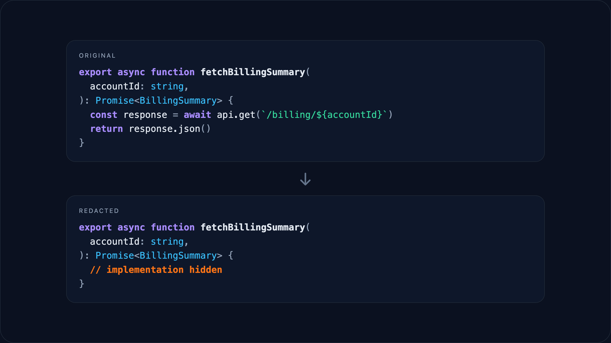

# opencode-blackbox

Redacts implementation details in file reads so testing agents can run true blackbox checks without seeing your implementation.



## Enable in OpenCode

```json
{
  "$schema": "https://opencode.ai/config.json",
  "plugin": ["opencode-blackbox"]
}
```

## Configure an agent

This plugin only redacts for agents that opt in via `options.blackbox`. You can also allowlist paths (for example, test fixtures) with `options.blackboxAllow`.

```jsonc
{
  "$schema": "https://opencode.ai/config.json",
  "agent": {
    "test-builder": {
      "description": "Builds and runs tests with redaction",
      "model": "anthropic/claude-sonnet-4-5",
      "options": {
        "blackbox": true,
        "blackboxAllow": ["**/tests/**", "**/*.test.{ts,tsx}"],
      },
    },
  },
}
```

## Use

- In the TUI, select the agent with `Tab` or type `@test-builder` in a message.
- In the CLI, run `opencode run --agent test-builder "Run the test suite"`.

Notes:

- Only `read` output is redacted; files written in the same session are never redacted.
- Line counts are preserved and only implementation bodies/initializers are hidden.
- You can customize reminder copy with `options.blackboxReminders`; reminders appear in the model-facing prompt alongside redacted output.

```jsonc
{
  "agent": {
    "test-builder": {
      "options": {
        "blackbox": true,
        "blackboxReminders": {
          "inline": "<system-reminder>\nImplementation redacted.\n</system-reminder>",
          "attachment": "<system-reminder>\nSome attachments were redacted.\n</system-reminder>",
        },
      },
    },
  },
}
```

## Example redaction

```ts
// before
export function add(a: number, b: number): number {
  const value = helperSecret()
  return a + b + value + hiddenValue
}

function helperSecret(value: number) {
  return value * 2
}

const hiddenValue = 42
```

```ts
// after
export function add(a: number, b: number): number {
  // implementation hidden
}

// implementation hidden

// implementation hidden
```

## Agent file alternative

You can define the same agent in a file under `.opencode/agents/`:

```md
---
description: Builds and runs tests with redaction
model: anthropic/claude-sonnet-4-5
options:
  blackbox: true
  blackboxAllow:
    - '**/tests/**'
    - '**/*.test.{ts,tsx}'
---

You build tests using only public interfaces.
You observe behavior by running tests and report mismatches.
It is fine to create failing tests to flag unclear behavior.
If tests fail, suggest renames, doc updates, or fixes.
```

The filename becomes the agent name (e.g. `test-builder.md`).
